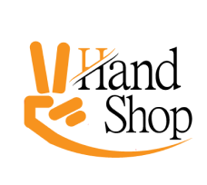

<h1> Second Hand Shop </h1>

The growing demand for second-hand goods, driven by affordability and environmental sustainability, necessitates a reliable and efficient platform for buying and selling such items. The current market lacks a dedicated platform, leading individuals to resort to social media platforms where the process is often time-consuming, inconvenient, and prone to fraud. Additionally, offline stores face limitations in opening hours and geographical reach. To address these challenges, we present a web application solution that provides a convenient and easy-to-use platform for sellers to list their items and for buyers to find and purchase them securely. Our web application streamlines the second-hand buying and selling process, offering features such as item listing, search functionality, secure transactions, chatbot and user authentication. By leveraging the power of web technology, our solution aims to enhance the overall experience, making it faster, reliable, and more accessible. The development of this web application will contribute to bridging the gap in the second-hand market, empowering individuals to engage in sustainable and cost-effective transactions while fostering trust between buyers and sellers.

Prototyping link:  
https://www.figma.com/file/4nQBZ8hWn9UGmPCbhSmf91/Untitled?type=design&node-id=0%3A1&t=QEKg73PXDxdqDsh3-1